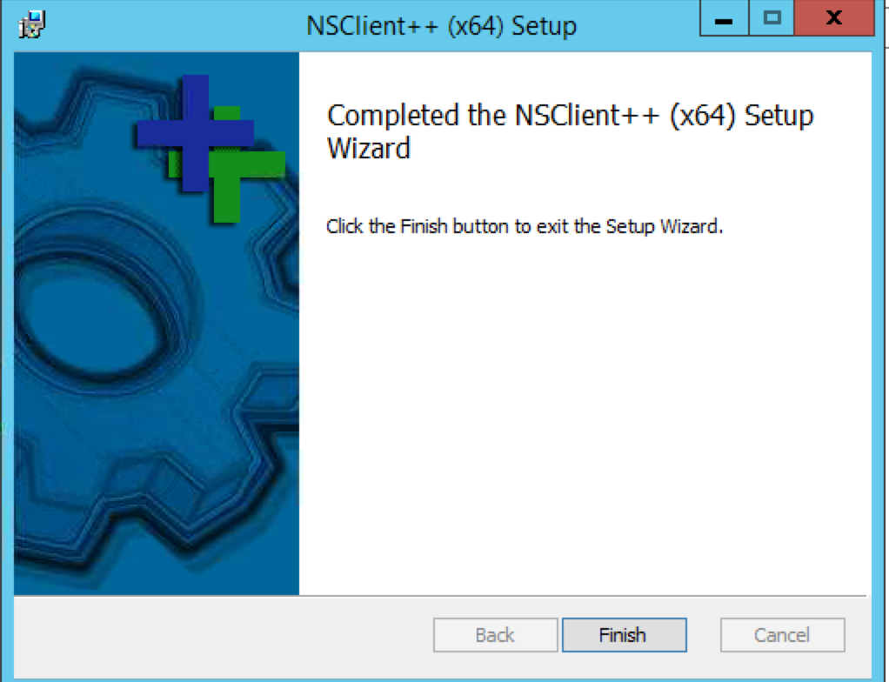

### icinga
Icinga setup

Step 1: Download the icinga 10.1 x86_64 package based on the architecture of your machine.
 https://packages.icinga.com/windows/
 https://packages.icinga.com/windows/Icinga2-v2.10.1-x86_64.msi
 

 You can automate these steps in a powershell terminal
 cd Downloads
 $WebClient = New-Object System.Net.WebClient
 $WebClient.DownloadFile("https://packages.icinga.com/windows/Icinga2-v2.10.1-x86_64.msi","Downloads\Icinga2-v2.10.1-x86_64.msi")
 Unblock-File -Path Icinga2-v2.10.1-x86_64.msi
 msiexec.exe /i Icinga2-v2.10.1-x86_64.msi

Steps 2-10 are optional. Follow these only if you're getting a dot net error during icinga install.

Step 2: If it prompts you for a dot net dependency, install it using the following steps:
Go to windows programs and features:
 

Step 3: Select "Turn windows features on or off"
 

Step 4: Click on next, choosing the options as shown:
 

Step 5: Click on next, choosing the options as shown:
 

Step 6: Click on next, choosing the options as shown:
 

Step 7: Select Features -> .NET framework 3.5 features
 

Step 8: Click on install:
 

Step 9: Wait for it to install:
 

Step 10: Once it's done, close the window:
 

Step 11: Install the agent downloaded in step 1.

Step 12: After that, open the agent setup wizard:
 

Step 13: Login to the icinga server machine and get the client/satellite token
  
Input the node name as it is (Even the case should be the same) and execute the above command.

Step 14: Once you obtain the token for the windows machine from above step, paste it in the node setup wizard in step 12 and also select the following options in the bottom right section:
Accept commands from master or satellite instances.
Accept config updates from master or satellite instances.
Install/update bundled NSClient++ (This will be installed later. It is required to check various metrics on the machine you're configuring this)
 

Step 15: Now click on the "Add button" to add the master info as it is shown below:
 

Step 16: Once you click on next, you will be presented with the following info:
 

Step 17: Click on next to complete the icinga node wizard setup.
 

Step 18: Now the installation for nsclient will start:
 

Step 20: Select the options as it is:
 

Step 21: Select the options as it is:
 

Step 22: Select the options as it is:
 

Step 23: Select the options as it is:
 

Step 24: Select the options as it is:
 

The new node metrics should now be visible on the icinga gui: http://172.16.0.23/icingaweb2/monitoring/list/hosts
 

When you try to download and install on windows servers, you might get the following errors:
 
